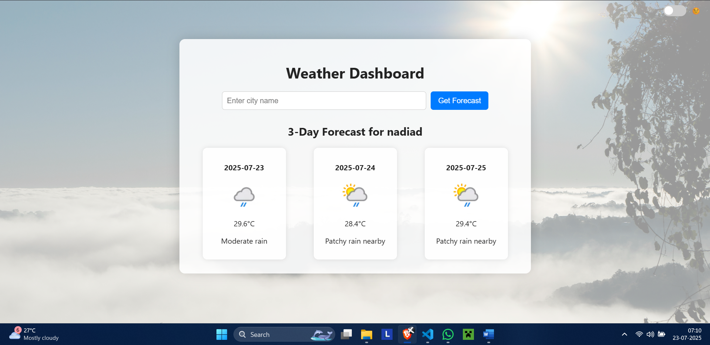

# Project II: Weather Dashboard & Forecast 🌦️

This is a full-stack Flask application that provides real-time weather conditions and a multi-day forecast for any city in the world. It integrates with a live weather API and visualizes the data in a clean, professional dashboard.



---

## Features

- **Real-Time Weather**: Get current temperature, conditions, humidity, and wind speed.
- **Multi-Day Forecast**: View a 3-day weather forecast with temperature highs/lows and conditions.
- **Global Search**: Users can search for any city worldwide.
- **Responsive Design**: The interface is optimized for both desktop and mobile devices.
- **Theme Toggle**: Switch between light and dark modes for user comfort.

---

## Technologies & API

- **Backend**: Python, Flask
- **Data Handling**: `pandas`, `requests`
- **Visualization**: `matplotlib` for generating forecast charts.
- **Frontend**: HTML, CSS, JavaScript, Jinja2
- **API Used**: [OpenWeather](https://rapidapi.com/worldapi/api/open-weather13)

---

## How to Run

1.  **Navigate to this project directory.**

    ```bash
    cd "WeatherDashboard"
    ```

2.  **Create and activate a virtual environment and install dependencies** (see parent README for instructions).

    ```bash
    pip install -r requirements.txt
    ```

3.  **Create a `.env` file** in this directory to store your API key. Add the following line to it:

    ```
    API_KEY="your_actual_api_key_here"
    ```

4.  **Run the application:**

    ```bash
    python app.py
    ```

5.  **Open your web browser** and go to `http://127.0.0.1:5000`.
